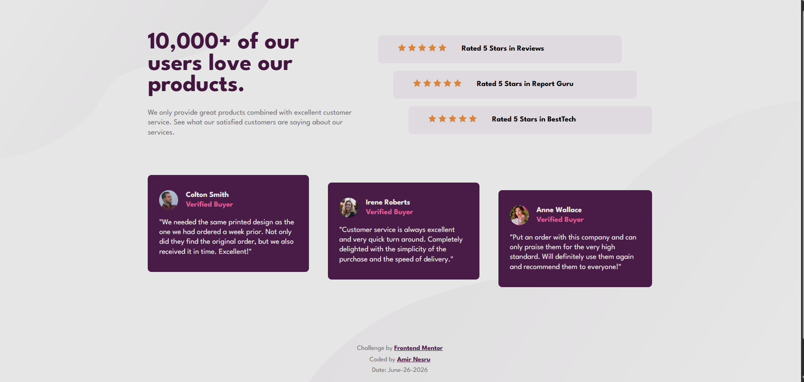

<<<<<<< HEAD
# Social Proof Section

A responsive solution to the Frontend Mentor challenge.

## Screenshot

## Built With

- HTML5
- CSS3
- Flexbox
- Mobile-first workflow

## Author

Amir Nesru
=======
# Development Journey

This repository contains projects, exercises, and practice work that I complete throughout my software development journey.

The purpose of this repository is to document my learning progress, strengthen my technical skills, and apply concepts through hands-on projects.

## What You Will Find

- Practice projects
- Bootcamp assignments
- Learning exercises
- Technical experiments
- Personal projects

## Goals

- Improve programming and problem-solving skills
- Build practical development experience
- Explore different technologies and tools
- Track my growth as a software engineer

## Technologies

The technologies used in this repository may vary depending on the project and learning objective.

## About Me

I am a Software Engineering student passionate about continuous learning and building practical software solutions.

## Author

Amir Nesru
>>>>>>> c578778b6f036727f41def0c248599f9576f69d1
